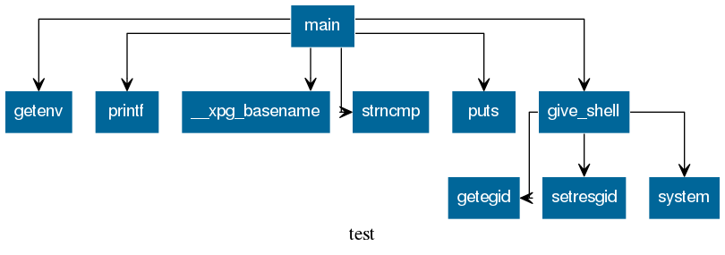

# Callgraph (v1.0 alpha)
Author: **Tomasuh**

_A simple callgraph plugin._

## Description:

This is a simple callgraph plugin that with the help of graphviz generates graphs. The user chooses traversal depth and sections that should not be traversed.
It has only been tested on elf binaries.

Right click on chosen function in the main window and choose "Generate function call graph", then just follow the instructions.

Here is a small example graph ("test" is the filename):

At the time of creating this repository I discovered that the following plugin provides this feature (and more) https://github.com/rick2600/binoculars/.
 
## Minimum Version

This plugin requires the following minimum version of Binary Ninja:

 * release - Not too old, not too new (tested on 1.0.13).

## Required Dependencies

The following dependencies are required for this plugin:

 * pip - graphviz
 * apt - graphviz, libgraphviz-dev

## License

This plugin is released under a [MIT](LICENSE) license.

